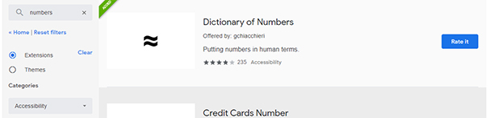

Third Journal Entry - Google Chrome Extensions
* Warren Rose II - 4/12/20

I am a regular user of the Google Chrome Web Browser and a fan of several of the extensions available in the Chrome Web Store.  I find this area most useful when I am searching for programs that promote better compatibility with specific brands, such as Pinterest and Steam Database.  The Pinterest Extension adds an easy to use button to every web image I move my mouse over to either save the image to my Pinterest archive or search for similar 'pinned' images.  SteamDB inserts fields such as how long it has been since the program was 'Last Updated' and what was the 'Lowest Price Recorded' to the individual Steam game entries, as well as providing a handy way to estimate how much money I've spent amassing my collection.

It's interesting what I can find by searching for random terms, such as typing in 'numbers' when I want to adjust how they appear in the webpages and how they function and a list of interesting things I can fiddle with pop up.  The Dictionary extension shown above is one tool found - it annotates text with easy comparisons like showing that '22 million' is the rough equivalent of a certain country's population.  Unfortunately, a wide search for extensions will generally have the first couple pages of results being games.  There is no option in the Chrome Web Store to specifically ignore games as it either shows all categories or one at a time.  This is often less than useful as there is often no clear separation between what is a 'Productivity' app and what is an 'Accessibility' one.  How easy it is to select the wrong category and never know what you could have been looking for means that this an **ineffective** design, as the user may give up in frustration before being able to complete their task or settle for a less-than-optimal solution. 

When all goes well, the icons for extensions hang out in the upper right corner of the screen, next to the address bar.  They stay there, sometimes adding useful things to the screen, sometimes operating mysteriously.  For instance, I'm consistently seeing 3 'requests' blocked by my uBlocker ad management extension while I'm editing this document on github - and I'm genuinely mystified as to why.  When everything's working smoothly, this improves my **safety** (enhances situations designed to protect the user from harm) through such things as blocking harmful things on phishing sites and improving my data security.  However, this ad blocking software can also impede my regular internet life through temporarily making certain legitimate websites inoperable, such as disabling the credit card entry field on the Comcast website, without a particularly **memorable** indicator of what is going on.
